# OAuth2.0学习与演示报告
by 黎志源
## OAuth2.0是什么？
> OAuth 2.0 is the industry-standard protocol for authorization. 
> OAuth 2.0 focuses on client developer simplicity while providing specific authorization flows for web applications,
> desktop applications, mobile phones, and living room devices.
>  -- oauth.net

OAuth 2.0是一个认证的工业级标准。OAuth2.0为web应用、桌面应用、移动手机和居家设备提供特定的认证流，致力于为客户端开发者提供便利。  
简单来说，OAuth2.0是一个广泛用于第三方认证的标准，而不是一个特定的接口或工具。
## OAuth2.0授权模式
OAuth框架为不同不同的使用环境指定了几种授权模式，同时也提供了创建新模式的框架  
以下是官网列出的OAuth常用的授权模式
- Authorization Code 授权码模式
- PKCE (Proof Key for Code Exchange)一种对于授权码模式的扩展，支持防止CSRF攻击
- Client Credentials 客户端模式
- Device Code 设备代码模式，用于无浏览器或输入受限的情况。
- Refresh Token 刷新令牌
- Implicit Flow 隐式授权（不建议）
- Passoword Grant 密码授权（不建议）  
### Client Credentials
客户端模式是最简单的授权模式，无法起到用户验证的作用，多用于服务器内部调用。
客户端认证步骤如下：  
1. 客户端直接向认证服务器申请授权。  
2. 认证服务器返回token令牌。  
3. 客户端拿到token令牌后，携带token向资源服务器请求资源。  
4. 资源服务器验证token令牌后，返回请求的资源。

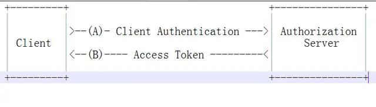
### Passoword Grant
密码授权模式具有很大的风险，需要第三方服务直接获取用户名密码等隐私信息，故不建议使用。  
密码授权模式认证步骤如下：  
1. 用户向第三方服务发送访问请求资源，并将用户名、密码交给第三方服务。  
2. 第三方服务携带用户名、密码向认证服务器发送授权申请。  
3. 认证服务器验证用户名、密码，返回token密钥。
4. 第三方服务拿到token令牌后，携带token向资源服务器请求资源。
5. 资源服务器验证token令牌后，返回请求的资源。  

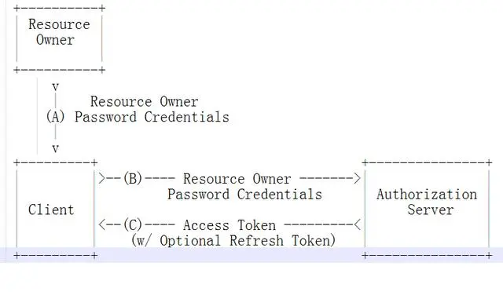  
### Implicit Flow
隐式授权是授权码模式的简化版，省略了授权码，直接将token暴露给用户，存在token泄露风险，故不建议使用。  
隐式授权认证步骤如下：  
1. 用户向第三方服务发送访问请求资源，第三方服务将用户重定向至认证服务器。
2. 用户在认证服务器进行登录授权操作，认证服务器返回token令牌给用户。
3. 第三方服务读取到token令牌后，携带token向资源服务器请求资源。
4. 资源服务器验证token令牌后，返回请求的资源。
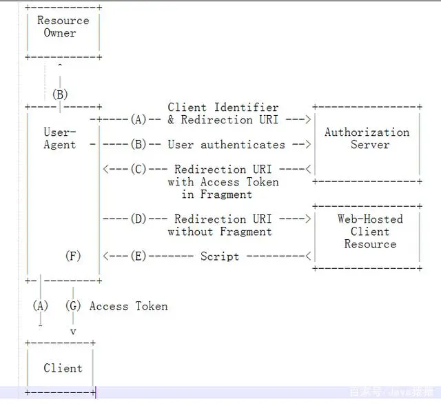  
### Authorization Code
授权码模式是最常用的授权模式。授权码模式既可以防止用户直接接触token,又防止了第三方服务获取用户密码等隐私信息，大大增加了授权的安全性。  
授权码模式认证步骤如下：
1. 用户向第三方服务发送访问请求资源，第三方服务将用户重定向至认证服务器。  
2. 用户在认证服务器进行登录授权操作，认证服务器返回code授权码给用户。  
3. 第三方服务读取到code授权码后，结合事先约定的client_id与secret密钥，向认证服务器请求token令牌。  
4. 认证服务器验证client_id、secret和code，并将token令牌给予第三方服务。  
5. 第三方服务拿到token令牌后，携带token向资源服务器请求资源。  
6. 资源服务器验证token令牌后，返回请求的资源。

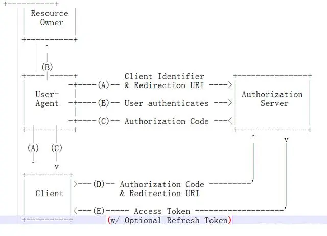  
## OAuth2.0实现
根据给定的教程，我使用spring-cloud-starter-oauth2包中对于OAuth2.0标准的实现。  
部分操作使用Postman模拟。  
### 环境与依赖
IDE: IDEA 2022.3.1  
spring-boot-dependencies: 2.6.13  
spring-boot-starter-web: 默认  
spring-boot-starter-security: 默认  
spring-cloud-dependencies: 2021.0.5  
spring-cloud-starter-oauth2: 2.2.5.RELEASE  
### 服务器结构  
- auth-server   
角色: 认证服务器  
URL: http://localhost:8081/sso  
- resource-server  
角色: 资源服务器  
URL: http://loclhost:8082/

### 结果展示
以下是我实现OAuth2.0的五种授权模式(Client Credentials, Passoword Grant, Implicit Flow, Authorization Code, Refresh Token)和check_token检验令牌的结果展示。  
#### Client Credentials
客户端模式只需指定client_id, client_secret即可直接获取token
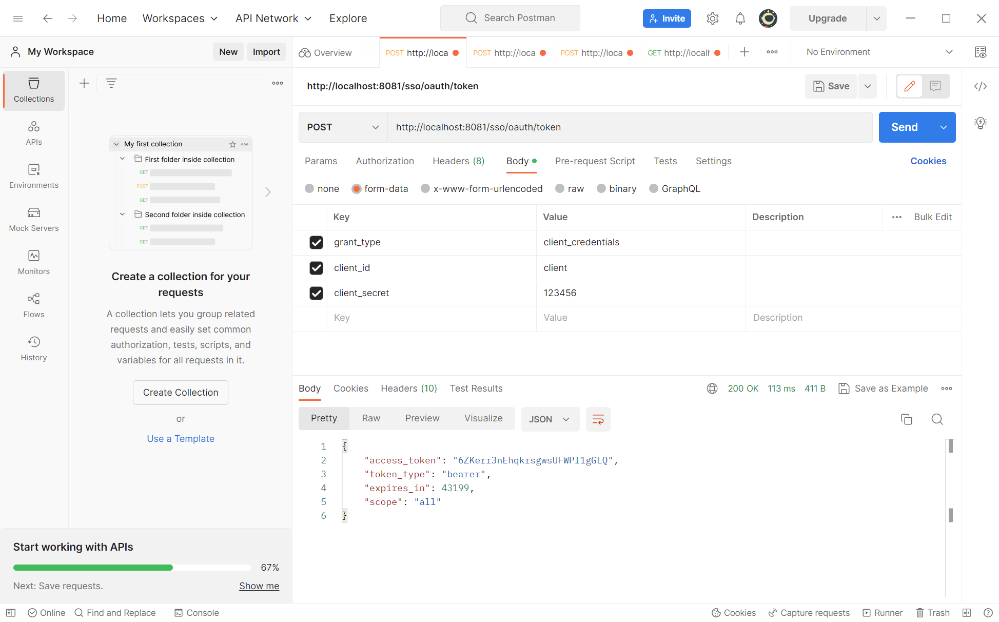  
#### Passoword Grant
密码授权模式除了指定client_id,client_secret外,还需提供username和password
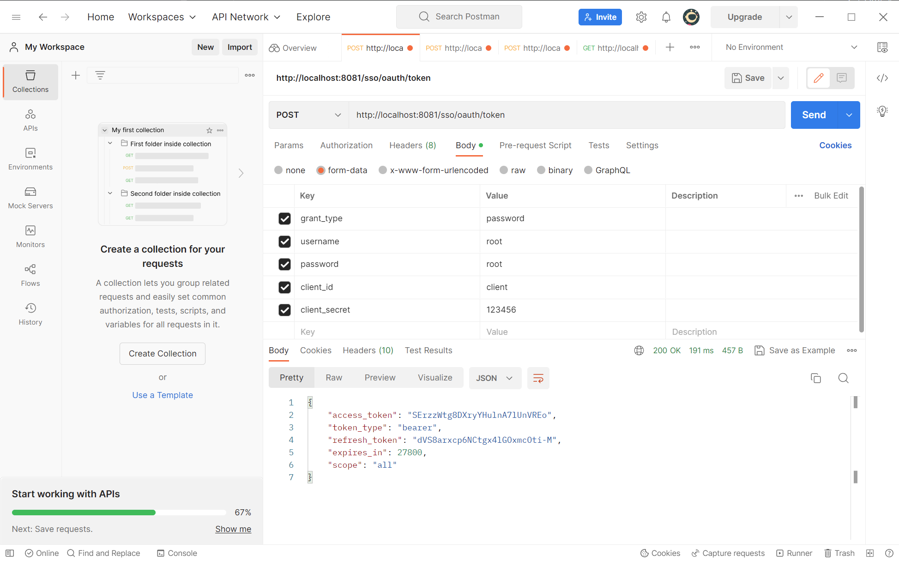
#### Implicit Flow
隐式授权需要用户重定向到认证服务器进行授权。  
首先访问 http://localhost:8081/sso/oauth/authorize?client_id=client&response_type=token  
服务器会自动重定向到登录页面 http://localhost:8081/sso/login  
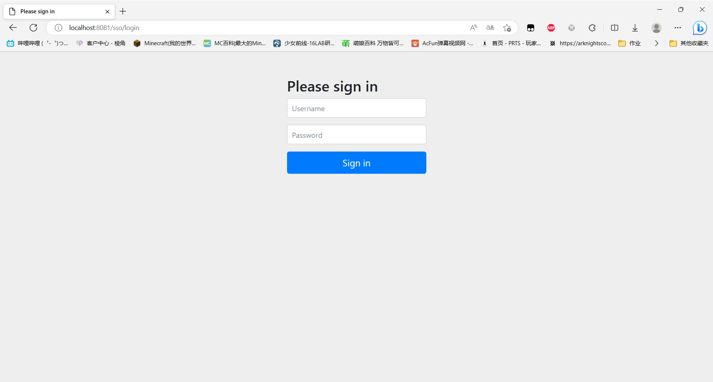 
登录成功后，会重定向到携带token的url。  
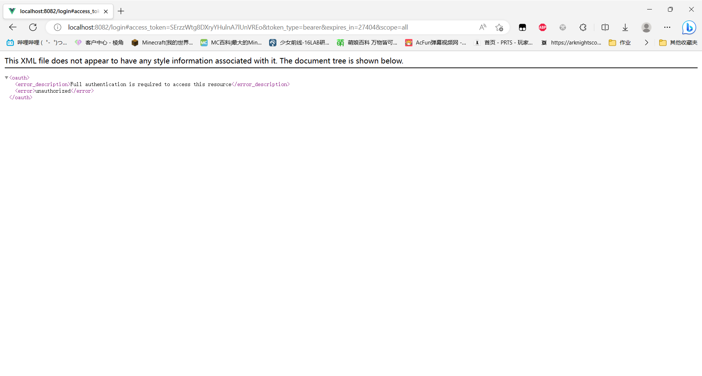  
#### Authorization Code
授权码模式需要用户重定向到认证服务器进行授权。  
首先访问 http://localhost:8081/sso/oauth/authorize?client_id=client&response_type=code  
服务器会自动重定向到登录页面 http://localhost:8081/sso/login  
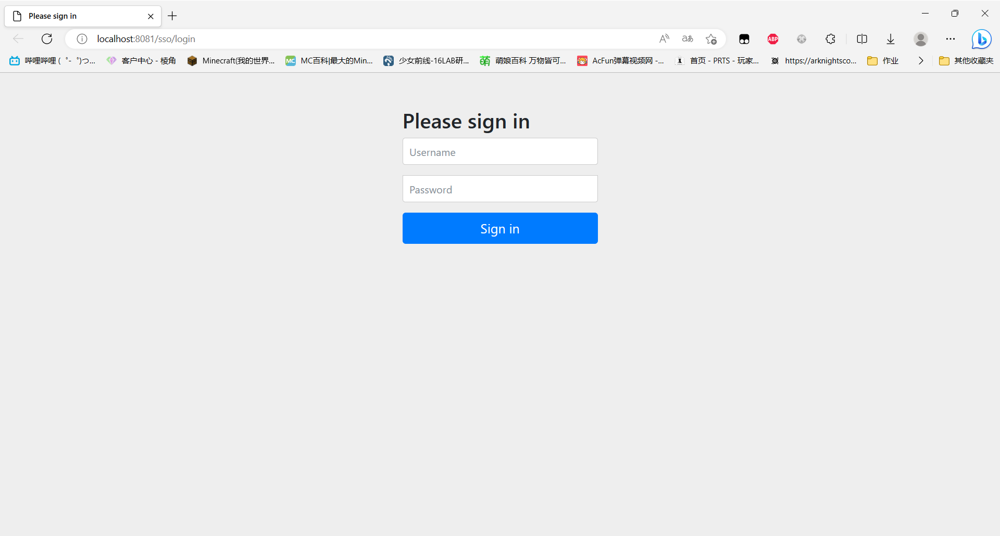
登录成功后，认证服务器会询问是否授权，选择授权。

授权后，重定向到认证携带了code的url。
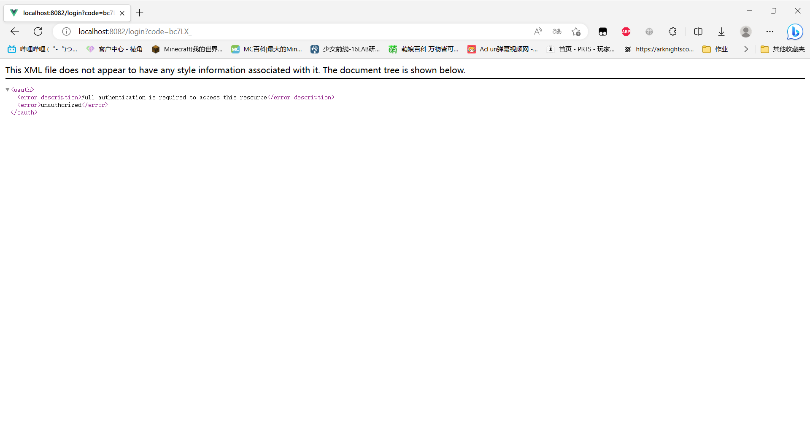
向认证服务器发送携带了client_id, client_secret, code的请求即可获取token
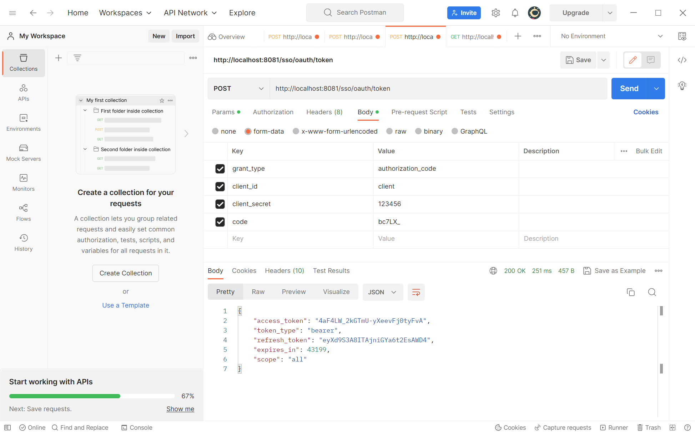
#### Refresh Token
refresh token用于在令牌过期时刷新令牌。
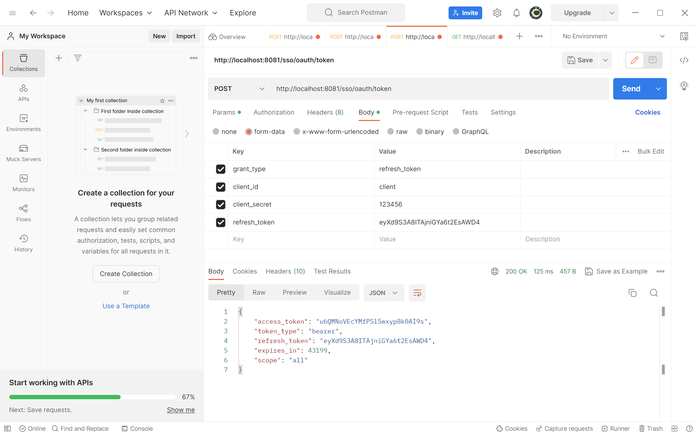
#### 获取资源
从认证服务器处获取到token后，可以携带token向资源服务器请求资源  
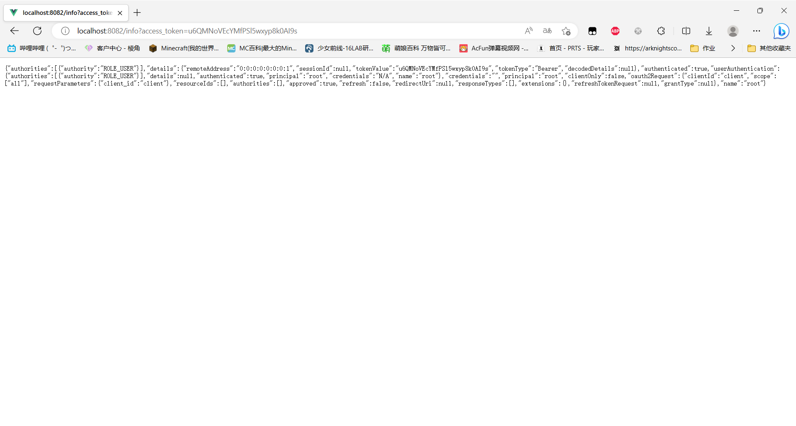
  
以上便是关于OAuth2.0五种授权模式，以及请求资源的演示。
## 项目源码
github仓库 
https://github.com/yuanqwq/OAuthTest/
## 参考资料
https://oauth.net/2/  
https://www.oauth.com/  
https://baijiahao.baidu.com/s?id=1667229742332338665  
...

